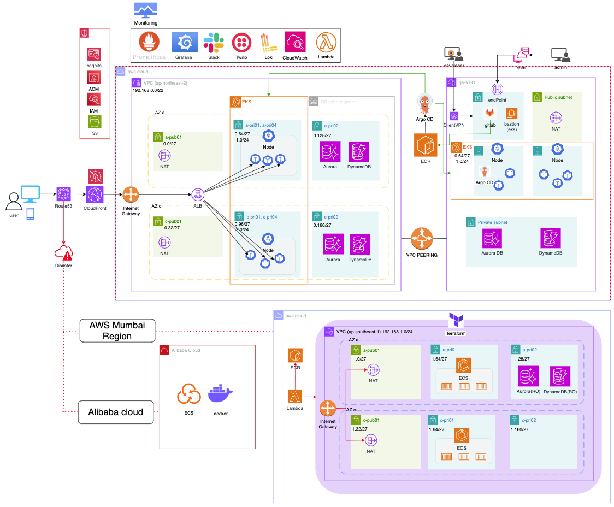
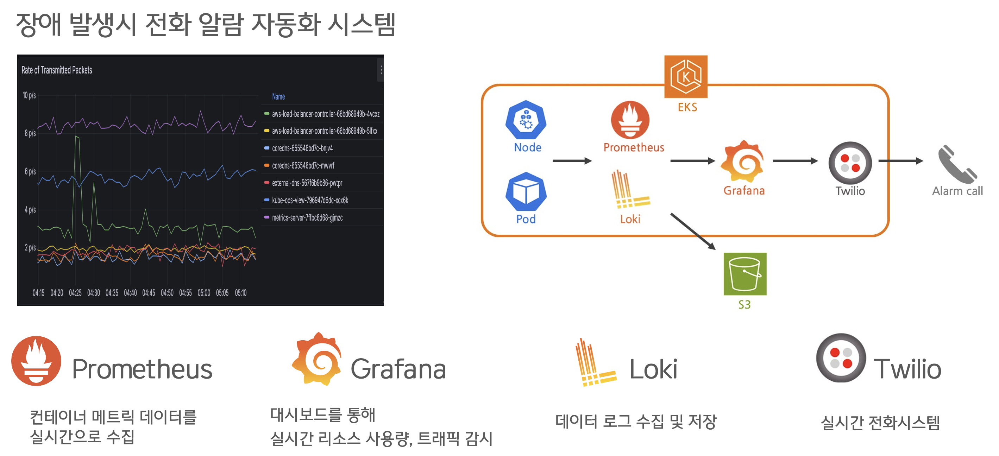

# CloudWave 3기 5조 `올리브영` 사이트 인프라 구성하기

  

  최종발표 최우수상(1위)

## 구성원

|  홍예슬 (PM)  |  우정인  |  유재균  |  한주호  |
| :-----: | :-----: |  :-----: |  :-----: | 
|  |  |  |  |
|[@HongYeseul](https://github.com/HongYeseul)| [@wooji9](https://github.com/wooji9)| [@JaeGyun-Yoo](https://github.com/JaeGyun-Yoo) | [@sohyunsung](https://github.com/sohyunsung) |

# 전체 아키텍처

저희 아키텍처는 크게 `개발계`, `배포계`, `DR`로 이루어져 있습니다.

## 1. 개발계

개발계는 개발 겸 QA를 위한 공간입니다. 때문에 아래의 3가지를 중점적으로 신경 썼습니다.

1. 쿠버네티스 내 Node와 Pod의 빠른 오토 스케일링
2. 서버 관리를 위한 보안
3. QA를 위한 파이프라인

1. 오토 스케일링

`Karpenter`와 `HPA`를 이용한 오토 스케일링을 하도록 했습니다. 없을 때와 비교하여 체감상 약 70%의 속도가 상승했습니다.

2. 보안 

`K8S Controller`를 위해 `AWS SSM`을 통한 엔드포인트로 접속하도록 했고, `private`로 유지하기 위해 CI/CD 툴에 `VPN`을 사용한 접근만 허용하도록 했습니다.

3. QA

`sonarQube`와 `AWS Device Farm`을 사용함으로써 `코드 검증`과 `기능 검증`을 하도록 했습니다.

`AWS Device Farm`은 쉽게 말해 `AWS`에서 기기를 대여 해주는 서비스인데, 테스트를 지시하면 결과에 따라 자동으로 결과에 대한 영상을 생성 해줍니다. `QA Pod`에서 해당 검증을 통해 통과가 되면 `PROD Pod`로 배포되도록 설계하였습니다.

## 2. 배포계

올리브영은 쇼핑몰로 모니터링이 중요합니다. 해당 클러스터에는 모니터링이 위치해 있습니다.

프로메테우스 및 그라파나, 로키를 사용해서 모니터링을 가능하도록 구성했고 서버에 장애가 발생할 때를 대비해 전화 알람 자동화 시스템을 구축했습니다.

## 3. DR

DR은 가중치 기반 라우팅을 사용하여 서울 `Pod`들이 죽으면 `Multi Cloud`와 `Multi Region`으로 라우팅 되도록 구성했습니다.

멀티 리전의 DR에 필요한 새로운 서버 이미지 파일의 경우 하루 한 번 람다를 이용해 ECR을 체크하여 이미지 최신화를 통해 ECS로 배포할 수 있도록 했습니다.

최종 발표 때 이미지 리포지토리에 푸시 되었을 때 람다를 작동시켜 멀티 리전으로 배포 할 수 있도록 구성하면 더 좋을 것이라는 피드백을 주셨습니다.

멀티 리전의 경우 테라폼으로 작성되었으며, [해당 리포지토리](https://github.com/cwave-druwa/terraform)에서 찾아보실 수 있습니다.

---

그 외 산출물

- [React FE](https://github.com/cwave-druwa/oliveyoung-fe)
- [BE deployment (K8S `yaml` 파일)](https://github.com/cwave-druwa/olive-young-server-deployment)
- [Spring Boot Main BE](https://github.com/cwave-druwa/olive-young-BE-main)
- [Spring Boot Sutter BE](https://github.com/cwave-druwa/olive-young-BE-shutter)